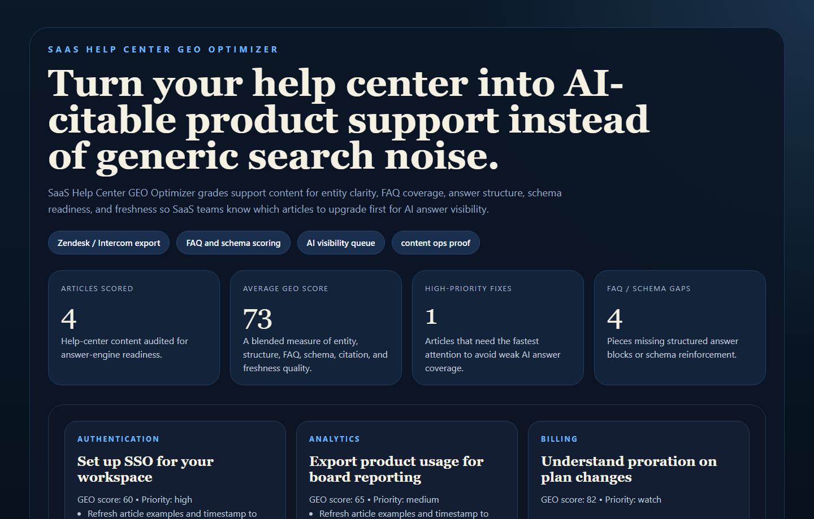
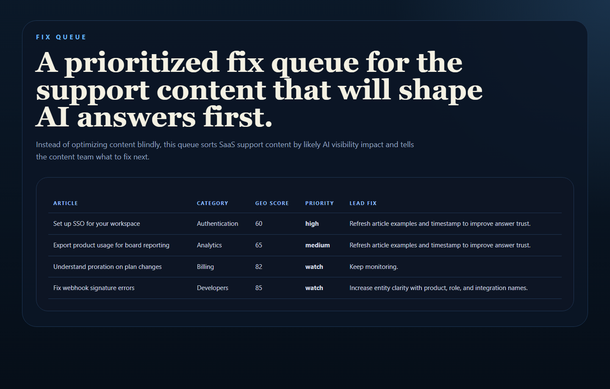
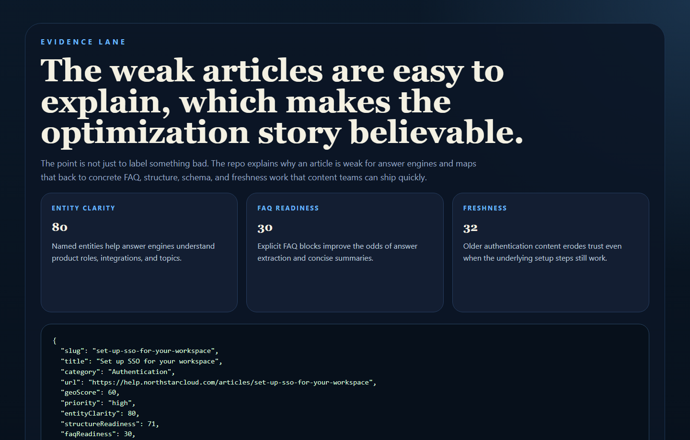
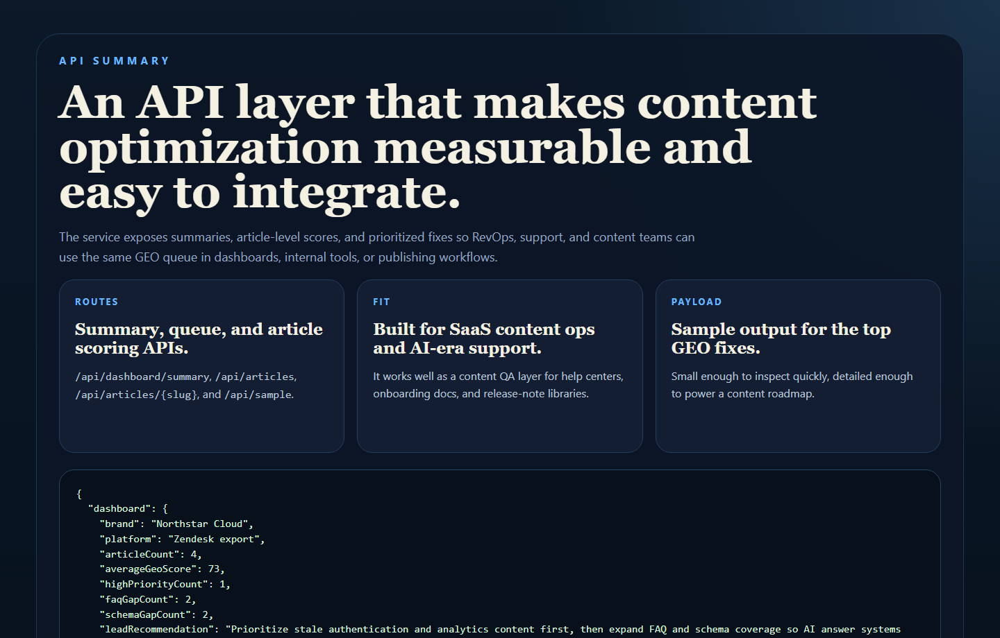

# SaaS Help Center GEO Optimizer

Score a SaaS help center for GEO readiness so support, marketing, and content
teams can turn support articles into AI-citable answers instead of generic
search leftovers.

## Why This Repo Is Good

- It sits directly at the intersection of marketing, SaaS, and analytics.
- It targets GEO and answer-engine visibility, not just old-school SEO.
- It produces a prioritized fix queue instead of vague “optimize your content” advice.
- It gives support and content teams a measurable way to improve AI answer coverage.

## What It Ships

- FastAPI scoring service
- realistic Zendesk-style help-center export
- GEO scoring for entity clarity, FAQ readiness, schema coverage, structure, citation value, and freshness
- article-level explanation surface
- real PNG screenshots generated from repo-owned proof pages
- tests and CI

## Screenshots

### Overview



### Fix Queue



### Evidence Lane



### API Summary



## Local Run

```powershell
cd saas-help-center-geo-optimizer
py -3.11 -m venv .venv
.\.venv\Scripts\python.exe -m pip install -r requirements.txt
.\.venv\Scripts\python.exe -m app.main
```

Open:

- [http://127.0.0.1:4617/](http://127.0.0.1:4617/)
- [http://127.0.0.1:4617/queue](http://127.0.0.1:4617/queue)
- [http://127.0.0.1:4617/evidence](http://127.0.0.1:4617/evidence)
- [http://127.0.0.1:4617/docs](http://127.0.0.1:4617/docs)

If that port is occupied:

```powershell
$env:PORT = "4621"
.\.venv\Scripts\python.exe -m app.main
```

## Validation

```powershell
cd saas-help-center-geo-optimizer
.\.venv\Scripts\python.exe -m unittest discover -s tests
.\.venv\Scripts\python.exe scripts\run_demo.py
.\.venv\Scripts\python.exe scripts\smoke_check.py
.\.venv\Scripts\python.exe scripts\render_readme_assets.py
```

## Example Output

```json
{
  "slug": "set-up-sso-for-your-workspace",
  "geoScore": 59,
  "priority": "high",
  "fixQueue": [
    "Refresh article examples and timestamp to improve answer trust.",
    "Add explicit FAQ blocks to increase answer extraction quality."
  ]
}
```

## Repo Layout

- `app/main.py`
- `app/services/geo_service.py`
- `app/data/sample_help_center.json`
- `docs/architecture.md`
- `scripts/render_readme_assets.py`

## Why It Matters for SaaS Teams

Help-center content is often some of the highest-intent material a SaaS company
publishes. If those pages are easy for AI systems to parse and cite, they can
influence:

- support deflection
- trial conversion
- product education
- brand authority in AI-generated answers
